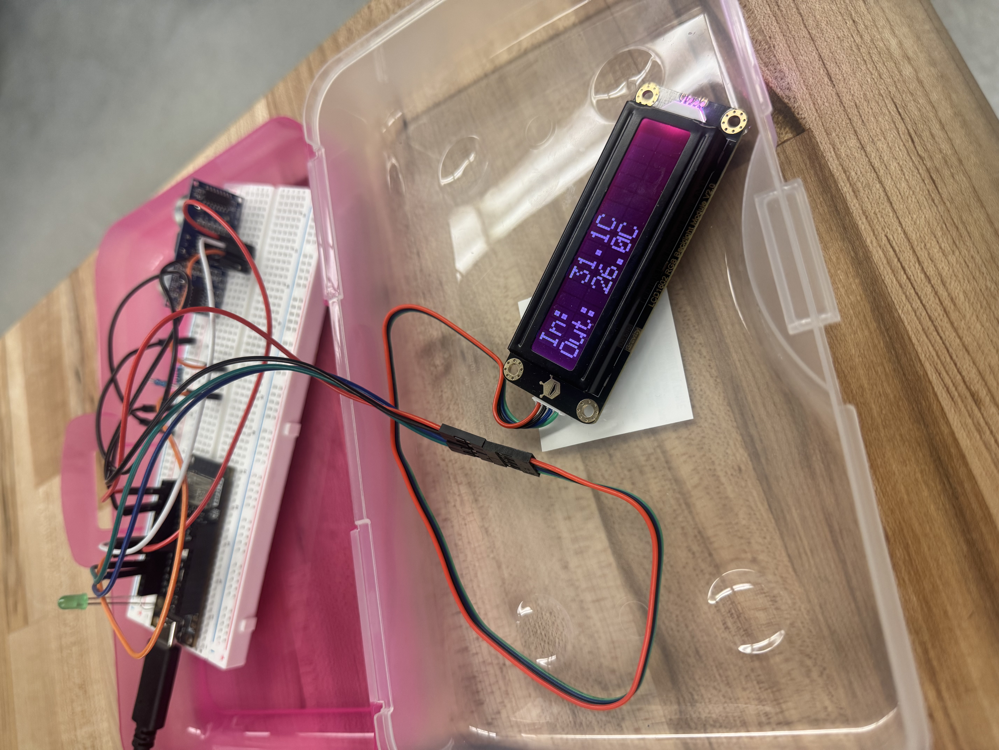
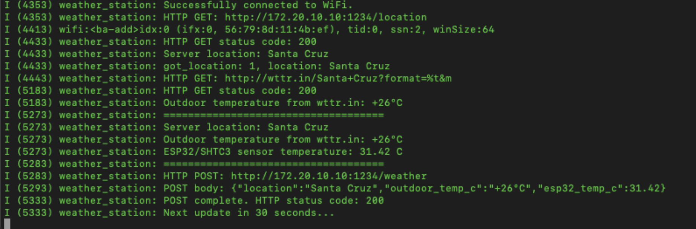

# ESP32 Weather Station

An embedded systems project built on the ESP32-C3 that collects local temperature data, retrieves live weather information from the internet, and communicates with a custom server over HTTP. The project integrates hardware peripherals, networking protocols, and modular firmware design to create a small IoT weather station.

## Overview

The ESP32-C3 acts as a network-connected weather station capable of:

- Reading temperature data from the onboard temperature sensor
- Displaying temperature locally on an LCD screen
- Sending HTTP requests to retrieve live outdoor weather data from an online API
- Communicating with a server running on a Raspberry Pi or computer
- Sending collected sensor data to the server using HTTP POST requests
- Receiving configuration data (location) from the server using HTTP GET requests

The goal of the project was to combine embedded programming, hardware communication, and internet connectivity into a fully functioning IoT system.

<p align="center">
    
</p>

## Features

**Sensor Integration**
- Reads internal ESP32 temperature sensor data
- Converts raw sensor data into usable temperature values

**LCD Display**
- Displays local sensor temperature in real time
- Modular LCD driver implementation for easy reuse in future projects

**Internet Weather API**
- Sends HTTP requests to [wttr.in](https://wttr.in)
- Retrieves current outdoor temperature based on location data

**Server Communication**
- Sends HTTP POST requests containing:
  - ESP32 internal temperature
  - Outdoor weather temperature
- Requests server-configured location using HTTP GET requests

**Modular Code Design**

Project separated into reusable modules for maintainability:
- LCD driver
- Temperature sensor functions
- WiFi/network handling
- HTTP request handling
- Server communication logic

## System Architecture

```
ESP32-C3
│
├── Read onboard temperature sensor
├── Display temperature on LCD screen
├── Request location from local server
├── Query wttr.in weather API
├── Receive outdoor temperature data
└── Send collected data back to server via HTTP POST

Local Server (Raspberry Pi / Laptop)
│
├── Handles GET requests for location
└── Receives POST requests containing temperature data
```

## Hardware Used

- ESP32-C3 Development Board
- LCD Display Module
- Raspberry Pi (or laptop acting as server)
- WiFi network connection

## Technologies Used

- C
- ESP-IDF Framework
- HTTP client/server communication
- REST API requests
- WiFi networking
- Embedded firmware development
- IoT communication protocols
- Python server scripting

## Repo Structure

```
.
├── firmware/       # ESP32-C3 source code (ESP-IDF project)
│   ├── main/
│   └── CMakeLists.txt
└── server/         # Python server (runs on Raspberry Pi or laptop)
    └── server.py
```

## Getting Started

### Requirements

- [ESP-IDF](https://docs.espressif.com/projects/esp-idf/en/latest/esp32c3/get-started/) (v5.x) installed and set up
- Python 3.x on the machine running the server
- ESP32-C3 dev board wired to the LCD display
- A WiFi network both the ESP32 and server machine can reach

### 1. Configure and flash the firmware

```bash
cd firmware
idf.py set-target esp32c3
idf.py menuconfig   # set WiFi SSID/password if configured here
idf.py build
idf.py -p <PORT> flash monitor
```

Update the server address/port and any location defaults in the firmware source before flashing, if these are hardcoded rather than set via `menuconfig`.

### 2. Run the server

```bash
cd server
python3 server.py
```

The server should be running and reachable on your local network before the ESP32 attempts to connect.

### 3. Power on the ESP32

Once flashed and powered on, the ESP32 will:
1. Connect to WiFi
2. Read the onboard temperature sensor
3. Display the temperature on the LCD
4. Request the configured location from the server
5. Query wttr.in for outdoor weather at that location
6. POST both temperature readings back to the server

## Example Workflow

1. ESP32 connects to WiFi
2. Reads onboard temperature sensor
3. Displays temperature on LCD screen
4. Sends GET request to local server for configured location
5. Requests live weather data from wttr.in API
6. Parses outdoor temperature response
7. Sends both local and outdoor temperatures back to the server via POST request
8. Server logs all received data

## What I Learned

This project gave me hands-on experience with several core embedded systems concepts:

- Building modular firmware instead of writing everything in a single source file
- Working with HTTP networking on microcontrollers
- Integrating hardware peripherals with application logic
- Structuring code for future reuse and maintainability
- Debugging communication between embedded devices and external servers
- Combining low-level embedded programming with higher-level networking concepts

One improvement I made beyond the original project requirements was reorganizing the LCD and temperature sensor code into reusable modules and integrating the LCD to provide local temperature readout directly on the device.

## Future Improvements

- Add humidity and pressure sensors
- Display outdoor weather data on the LCD
- Store historical temperature data locally
- Push data to a cloud database instead of a local server
- Build a web dashboard for live monitoring

## Demo 


<p align="center">
    
</p>

*Serial monitor output showing a full update cycle — WiFi connect, a GET request to wttr.in for outdoor temperature, an SHTC3 sensor reading, and a POST request sending both values to the local server, with a 200 OK response confirming receipt.*

<p align="center">
    
</p>

*The ESP32-C3 on a breadboard driving the LCD, showing live indoor ("In:") and outdoor ("Out:") temperature readings on the device itself.*